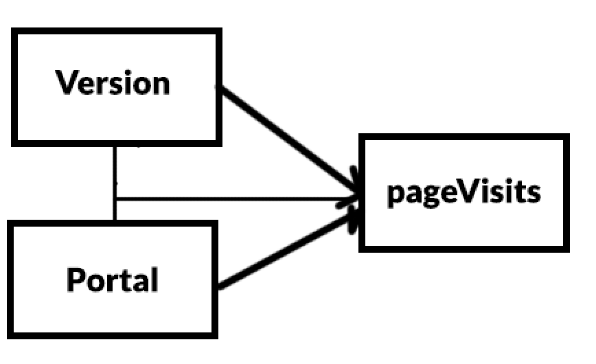

```{r}

```


```{r}
visits <- read.csv('webvisit1.csv')
visits$versionF <- factor(visits$version)
visits$portalF <- factor(visits$portal)

test_data = visits[1:20, ]
train_data = visits[21:nrow(visits), ]
```

```{r}
summary(visits)
```


```{r}
# Graphically examine the variation in page visits for different factors
# levels (e.g. histogram, density plot etc.)
visits0 <- visits[visits$version == 0,]
hist(visits0$pages, xlab="Pages", main="Version 0" )
visits0 <- visits[visits$version == 1,]
hist(visits0$pages, xlab="Pages", main="Version 1")
visits0 <- visits[visits$portal == 0,]
hist(visits0$pages, xlab="Pages", main="No portal")
visits0 <- visits[visits$portal == 1,]
hist(visits0$pages, xlab="Pages", main="Using portal")
```


```{r}
visits0 <- visits[visits$version == 0,]$pages
visits1 <- visits[visits$version == 1,]$pages
visits2 <- visits[visits$portal == 0,]$pages
visits3 <- visits[visits$portal == 1,]$pages
boxplot(visits0, visits1, visits2, visits3,  names = c("version 0", "version 1", "portal 0", "portal 1"))
```

```{r}
# 3 - Statistically test if variable page visits deviates from normal distribution
shapiro.test(visits$pages)
# p-value is very small, variable pages does not follow a normal distribution
```


```{r}
model0 <-glm(pages~1 , data = train_data, na.action = na.exclude, family=poisson)
model1 <-glm(pages~version  , data = train_data, na.action = na.exclude, family=poisson)
model2 <-glm(pages~portal , data = train_data, na.action = na.exclude, family=poisson)
model3 <-glm(pages~version+portal , data = train_data, na.action = na.exclude, family=poisson)
model4 <-glm(pages~version+portal+version*portal , data = train_data, na.action = na.exclude, family=poisson)
```

```{r}
anova(model0,model1)
anova(model0,model2)
anova(model3,model4)
anova(model4)
```
```{r}
anova(model0,model1,model2,model3, model4, test = "Chisq")
```

```{r}
visits$simple <- interaction(visits$version, visits$portal)
levels(visits$simple)
portalConsumer <- c(1, -1, 0, 0)
portalCompany <- c(0, 0, 1, -1)
simpleEff <- cbind(portalConsumer, portalCompany)
contrasts(visits$simple) <- simpleEff
simpleEffectModel <- glm(pages~simple, data = visits, na.action = na.exclude, family=poisson)
summary.glm(simpleEffectModel)
```
```{r}
visits$simple <- interaction(visits$version, visits$portal)
levels(visits$simple)
version0 <- c(1, 0, -1, 0)
version1 <- c(0, 1, 0, -1)
simpleEff <- cbind(version0, version1)
contrasts(visits$simple) <- simpleEff
simpleEffectModel <- glm(pages~simple, data = visits, na.action = na.exclude, family=poisson)
summary.glm(simpleEffectModel)
```


```

```{r}
# By viewing the results of the anova test, we can see that both adding portal and version information have an significant effect on the model. Secondly, we compare the model containing both the varables (version adn portal) with the model containing also the interaction between the two variables. This also shows that the inclusion of the intercacion of the two variables in the model has a significant effect on the model. Therefore the model which should be used to perorm a linear regression on this data should be model4. However, we can see by analyzing the histogram of the page visits, that the distribution of the data is very skewed to one side. This makes is harder to obtain a well-performing linear model for this data. In fact if we inspect the R-squared value of the anova test, we see only a result of 0.22% showing that this model does not accurately fit the data. 
```

